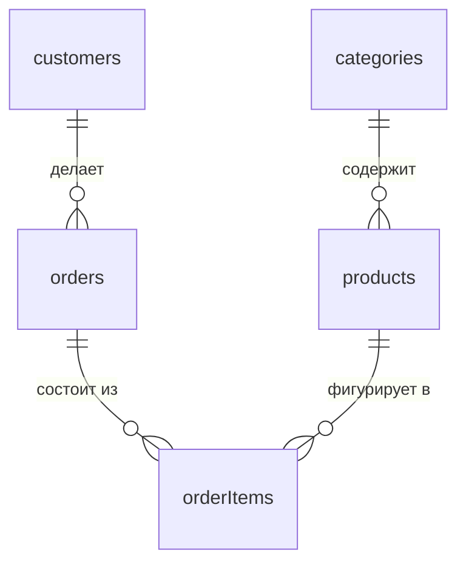

# Модель связей: 1:1, 1:N, M:N, ER-диаграммы; JOIN — способ получить данные связанных сущностей

## Ранее в курсе

- Урок 1 уровня «Основы» «Что такое БД и СУБД» — таблицы, строки, столбцы, `SELECT`.
- Урок 2 уровня «Основы» «MySQL сервер и клиент» — клиент-серверная архитектура, базы данных, `USE`.
- Урок 3 уровня «Основы» «Синтаксис SQL и SELECT» — синтаксис запросов, `LIMIT`.
- Урок 4 уровня «Основы» «Добавление данных» — `INSERT INTO ... VALUES ...`.
- Урок 5 уровня «Основы» «Типы данных» — `INT`, `DECIMAL`, `VARCHAR`/`TEXT`, `DATE`/`DATETIME`, `BOOL`, `utf8mb4`.
- Урок 6 уровня «Основы» «Создание таблиц с ограничениями» — `CREATE TABLE`, `PRIMARY KEY`, `AUTO_INCREMENT`, `NOT NULL`, `UNIQUE`, `DEFAULT`, `CHECK`.
- Урок 7 уровня «Основы» «Изменение и удаление объектов» — `ALTER TABLE`, различия `DELETE`/`TRUNCATE`/`DROP`.
- Урок 8 уровня «Основы» «Фильтрация WHERE» — операторы сравнения, `<>`, отбор строк по условию.
- Урок 9 уровня «Основы» «Сортировка и страницы» — `ORDER BY`, `LIMIT`/`OFFSET`, постраничный вывод.
- Урок 10 уровня «Основы» «Изменение и удаление строк» — `UPDATE ... WHERE`, `DELETE ... WHERE`, опасность отсутствия `WHERE`.
- Урок 11 уровня «Основы» «NULL на практике» — отличие `NULL` от `0`/пустой строки, `IS NULL`/`IS NOT NULL`, `COALESCE`, `NULLIF`.
- Урок 12 уровня «Основы» «Мини-проект «Каталог товаров»» — сборка `CREATE TABLE` → `INSERT` → `SELECT`/`WHERE` → `ORDER BY` → `UPDATE`/`DELETE` в единый сценарий работы с данными.
- Урок 1 уровня «Начинающий» «Логические операторы» — `AND`/`OR`/`NOT`, приоритет операторов, обязательные скобки в составных условиях.
- Урок 2 уровня «Начинающий» «IN, BETWEEN, LIKE» — принадлежность списку, диапазоны, поиск по текстовому шаблону, `ESCAPE`.
- Урок 3 уровня «Начинающий» «Вычисления, псевдонимы, DISTINCT» — арифметика в `SELECT`, `AS`, `CONCAT`, уникальные строки.
- Урок 4 уровня «Начинающий» «Строковые функции» — `UPPER`/`LOWER`, `SUBSTRING`, `TRIM`, `REPLACE`, `LENGTH`/`CHAR_LENGTH`.
- Урок 5 уровня «Начинающий» «Числа и даты» — `ROUND`/`FLOOR`/`ABS`, `NOW`, `DATEDIFF`, `DATE_ADD`, `DATE_FORMAT`, `EXTRACT`, `TIMESTAMPDIFF`.
- Урок 6 уровня «Начинающий» «Логический порядок выполнения SELECT» — `FROM → WHERE → GROUP BY → HAVING → SELECT → ORDER BY`, почему псевдоним недоступен в `WHERE`.
- Урок 7 уровня «Начинающий» «CASE WHEN» — простой и поисковый `CASE`, категоризация значений, условная сортировка.
- Урок 8 уровня «Начинающий» «Агрегатные функции» — `COUNT`, `SUM`, `AVG`, `MIN`, `MAX`; поведение с `NULL`.
- Урок 9 уровня «Начинающий» «GROUP BY» — группировка по одному и нескольким столбцам, условные агрегаты `COUNT(CASE ...)`.
- Урок 10 уровня «Начинающий» «HAVING vs WHERE» — фильтрация строк до группировки против фильтрации готовых групп.

## Материал

Все запросы, которые мы писали до сих пор, работали с **одной** таблицей за раз. Но реальная база данных интернет-магазина, которую мы используем на протяжении всего курса, — это не одна таблица `products`, а целый набор связанных сущностей: товары принадлежат категориям, заказы делают клиенты, заказ состоит из позиций, ссылающихся на конкретные товары. Прежде чем в следующих уроках мы начнём писать запросы, которые **соединяют** данные из нескольких таблиц одновременно (конструкция `JOIN`), нужно как следует разобраться, **какие вообще бывают связи между таблицами** и как их представлять на бумаге — эта модель определяет структуру любой более-менее сложной базы данных, а `JOIN` — просто способ *прочитать* эту структуру запросом.

### Почему одной таблицы недостаточно

Представим на минуту, что все данные интернет-магазина хранились бы в одной гигантской таблице — например, «заказ» со столбцами: `id`, `customer_name`, `customer_email`, `customer_city`, `product_name`, `product_price`, `quantity`. У такого подхода сразу несколько серьёзных проблем:

- **Дублирование данных.** Если клиент Иван Петров сделал 10 заказов, его имя, email и город повторятся в таблице 10 раз. Если он захочет изменить email, придётся обновить все 10 строк — а если забыть одну, данные о клиенте окажутся противоречивыми внутри одной и той же таблицы.
- **Аномалии при отсутствии данных.** Если клиент зарегистрировался, но ещё не сделал ни одного заказа, для него вообще не будет строки в такой таблице — данные о самом факте регистрации клиента негде хранить, если структура таблицы завязана на существование заказа.
- **Ограниченная гибкость.** Что делать, если у заказа несколько разных товаров? Пришлось бы либо повторять строку заказа для каждого товара (снова дублирование части данных — тех же `customer_name`/`customer_email`), либо изобретать какие-то нестандартные текстовые форматы внутри одной ячейки, что полностью противоречит идее реляционной модели из первого урока «Основ».

Решение этих проблем — **разделить** данные по смыслу на отдельные таблицы, каждая для одной сущности (клиент, товар, заказ), и связать их между собой ссылками, а не хранить всё вперемешку в одной таблице. Именно такое разделение мы уже видим в сквозном датасете курса: `customers`, `products`, `categories`, `orders`, `order_items`.

### Первичный и внешний ключ: как таблицы ссылаются друг на друга

Механизм, которым одна таблица «ссылается» на строку другой таблицы, нам уже отчасти знаком: в шестом уроке «Основ» мы разбирали `PRIMARY KEY` — столбец (обычно `id`), однозначно идентифицирующий строку внутри её собственной таблицы. Столбец в **другой** таблице, который хранит значение первичного ключа связанной строки, называется **внешним ключом** (foreign key). Например, таблица заказов может содержать столбец `customer_id`: для конкретного заказа значение `customer_id = 42` означает «этот заказ сделан клиентом, у которого `id = 42` в таблице `customers`». Подробное синтаксическое оформление внешнего ключа средствами MySQL (ограничение `FOREIGN KEY`, автоматическая проверка целостности, поведение при удалении связанной строки) — тема отдельного, следующего урока этого уровня; здесь же важно понять сам принцип связи «по значению ключа», независимо от того, оформлена ли эта связь формальным ограничением в базе данных или существует только по договорённости в структуре данных.

### Три вида связей между таблицами

В реляционном моделировании принято выделять три базовых типа связей между двумя сущностями — они описывают, **сколько** строк одной таблицы может соответствовать **скольким** строкам другой.

**Связь «один к одному» (1:1)** означает, что одной строке первой таблицы соответствует ровно одна строка второй таблицы, и наоборот. В нашем сквозном датасете такой связи в чистом виде нет, но типичный пример из практики — таблица `users` (логин, пароль, дата регистрации) и отдельная таблица `user_profiles` (дополнительные, не всегда заполняемые данные: биография, аватар, дата рождения): у каждого пользователя есть ровно один профиль, и данные разделены на две таблицы не из-за характера связи «многие», а по другим практическим причинам — например, чтобы не хранить редко используемые крупные поля (аватар) вместе с часто читаемыми учётными данными.

**Связь «один ко многим» (1:N, иногда пишут 1:М)** — самый распространённый тип связи: одной строке первой таблицы может соответствовать **много** строк второй таблицы, но каждая строка второй таблицы связана только с **одной** строкой первой. Классический пример из нашего датасета — связь между `customers` и `orders`: один клиент может сделать много заказов, но у каждого конкретного заказа есть ровно один клиент, оформивший его. Точно такая же связь — между `categories` и `products`: у категории может быть много товаров, но у каждого товара — только одна категория (в упрощённой модели, без учёта товаров с несколькими категориями). Именно связь 1:N реализуется через внешний ключ: столбец `customer_id` находится в таблице «многих» (`orders`), а не в таблице «одного» (`customers`) — потому что у одного клиента может быть много значений «идентификатор заказа», но не наоборот.

**Связь «многие ко многим» (M:N)** — самая сложная из трёх: множество строк одной таблицы может соответствовать множеству строк другой, и наоборот. В нашем датасете такая связь — между заказами и товарами: один заказ обычно включает несколько разных товаров, и один и тот же товар, конечно, может встречаться в множестве разных заказов. Связь M:N **невозможно** выразить простым внешним ключом в одной из двух таблиц (в `orders` нельзя добавить один столбец «товар», если товаров в заказе несколько, — мы уже разбирали эту проблему выше в разделе про единую гигантскую таблицу). Поэтому связь M:N всегда реализуется через дополнительную, **связующую таблицу** — в нашем случае это `order_items`: каждая её строка хранит **один** `order_id` и **один** `product_id`, то есть описывает связь ровно между одним заказом и одним товаром (плюс дополнительные данные, специфичные именно для этой пары — например, `quantity` — сколько единиц этого товара было в этом заказе, и `price` — цена товара именно на момент этого конкретного заказа, что мы обсудим подробнее, когда будем изучать саму таблицу `order_items` на уровне JOIN). Формально связь M:N между `orders` и `products` через связующую таблицу `order_items` на самом деле раскладывается на **две** связи 1:N: `orders` 1:N `order_items` (у заказа много позиций, у позиции — один заказ) и `products` 1:N `order_items` (у товара может быть много позиций в разных заказах, у позиции — один товар).

### ER-диаграммы: визуальное представление связей

Структуру таблиц и связей между ними принято изображать графически — такая схема называется **ER-диаграммой** (Entity-Relationship diagram, «диаграмма сущность-связь»). Каждая сущность (будущая таблица) изображается прямоугольником со списком её атрибутов (будущих столбцов), а связи между сущностями — линиями с обозначением их типа (1:1, 1:N, M:N), часто с указанием направления «один» и «много» на концах линии специальными символами.

Такая диаграмма — не просто иллюстрация «для красоты»: она служит основным инструментом проектирования схемы данных **до** того, как написана хотя бы одна строка `CREATE TABLE`. Разработчик, проектирующий новую базу данных, начинает именно с выявления сущностей и связей между ними на диаграмме — и только после этого переводит диаграмму в конкретные таблицы, столбцы, первичные и внешние ключи. Умение читать такую диаграмму и по ней восстанавливать, какие таблицы потребуют `JOIN` и в каком направлении, — важный практический навык, который пригодится не только при написании запросов, но и при первом знакомстве с чужой (или очень давно созданной собственной) базой данных.

### JOIN — не синтаксис, а способ восстановить связанные данные

Всё, что мы разобрали в этом уроке — ключи, три типа связей, ER-диаграмма, — существует не как абстрактная теория, а как прямая подготовка к практическому вопросу: как **прочитать** данные, распределённые по нескольким связанным таблицам, одним запросом? Например, вывести список заказов вместе с именем клиента, который их сделал — эта информация физически хранится в двух разных таблицах (`orders.customer_id` — только идентификатор, а настоящее имя — в `customers.name`), и обычный однотабличный `SELECT` не способен «дотянуться» до второй таблицы.

Именно эту задачу решает конструкция `JOIN` — она **соединяет** строки одной таблицы со строками другой по совпадению значений ключа (обычно первичного ключа одной таблицы и внешнего ключа другой), формируя единый временный результат, в котором доступны столбцы из обеих таблиц сразу — как если бы, хотя бы для этого одного запроса, данные снова оказались собраны в одну широкую таблицу, но без постоянного физического дублирования, свойственного подходу «хранить всё в одной таблице», который мы критиковали в начале урока. Важно с самого начала воспринимать `JOIN` именно так — не как «ещё один загадочный оператор SQL, который нужно выучить», а как прямое, логичное следствие того, что данные правильно спроектированной базы **разделены** по смыслу на несколько таблиц: раз данные разделены при хранении, нужен инструмент, чтобы **временно** собрать их обратно при чтении, — и `JOIN` — ровно этот инструмент. Подробный синтаксис и разные виды `JOIN` (внутреннее и внешнее соединение, соединение таблицы с самой собой) — тема следующих уроков этого уровня; здесь заложена концептуальная основа, без которой синтаксис `JOIN` выглядел бы произвольным набором правил, а не логичным решением конкретной, только что разобранной задачи.

### Резюме

- Разделение данных на несколько связанных таблиц (а не хранение всего в одной) устраняет дублирование данных и структурные ограничения, свойственные «одной большой таблице».
- Первичный ключ (`PRIMARY KEY`) однозначно определяет строку внутри своей таблицы; внешний ключ — столбец в другой таблице, хранящий значение первичного ключа связанной строки.
- **1:1** — одной строке соответствует ровно одна строка другой таблицы; **1:N** — одной строке «главной» таблицы соответствует много строк «подчинённой» (внешний ключ находится именно в подчинённой таблице); **M:N** — множеству строк одной таблицы соответствует множество строк другой, и такая связь всегда реализуется через дополнительную связующую таблицу (в нашем датасете — `order_items` между `orders` и `products`).
- ER-диаграмма — графическое представление сущностей (будущих таблиц) и связей между ними; она предшествует написанию `CREATE TABLE` при проектировании схемы данных.
- `JOIN` — не произвольная синтаксическая конструкция, а прямой практический инструмент чтения данных, разделённых по нескольким связанным таблицам, восстанавливающий связь на уровне одного запроса без постоянного физического дублирования данных при хранении.

## Теоретические задания

### Вопрос 1: Какой тип связи между таблицами customers и orders в модели «один клиент делает много заказов»?

- ✅ один-ко-многим (1:N)
<!-- каждой строке «одного» соответствует много строк «многих»; внешний ключ — в таблице «многих» -->
- ❌ один-к-одному (1:1) — error_text: 1:1 означал бы, что у клиента ровно один заказ, а у заказа ровно один клиент. Второе верно, первое нет: клиент может оформить сколько угодно заказов — поэтому связь 1:N.
- ❌ многие-ко-многим (M:N) — error_text: M:N требовала бы, чтобы и один заказ принадлежал сразу нескольким клиентам. Но у каждого заказа ровно один покупатель — customer_id хранит одно значение, поэтому связь 1:N.
- ❌ таблицы не связаны — error_text: связь есть: orders хранит customer_id — внешний ключ со значением первичного ключа клиента. Именно по этому значению заказ «знает», чей он.

### Вопрос 2: Где находится внешний ключ, реализующий связь 1:N между customers и orders?

- ✅ в таблице «многих» — orders содержит столбец customer_id
<!-- внешний ключ живёт в подчинённой таблице: у заказа один клиент, у клиента много заказов -->
- ❌ в таблице «одного» — customers содержит order_id — error_text: один столбец хранит одно значение: такой ключ привязал бы клиента ровно к одному заказу. Много заказов одного клиента одним столбцом в customers не выразить.
- ❌ в отдельной связующей таблице — error_text: связующая таблица — способ реализовать связь M:N, раскладывая её на две связи 1:N. Для прямой связи 1:N достаточно внешнего ключа в таблице «многих».
- ❌ внешний ключ в этой связи не нужен — error_text: связь должна на чём-то держаться: заказ ссылается на клиента значением customer_id. Оформление этой ссылки ограничением FOREIGN KEY — тема следующего урока, но сама ссылка по значению ключа — суть связи.

### Вопрос 3: Почему связь «заказы — товары» (M:N) нельзя реализовать внешним ключом в одной из двух таблиц?

- ✅ у заказа несколько товаров и товар входит во много заказов — одно значение столбца такую связь не покроет
<!-- M:N реализуется связующей таблицей: order_items с парами order_id + product_id -->
- ❌ можно — достаточно столбца product_id в orders — error_text: столбец product_id привязал бы заказ к одному товару, а заказ обычно состоит из нескольких. Хранить список товаров в одной ячейке противоречит реляционной модели — материал урока разбирает это как проблему «одной большой таблицы».
- ❌ связи M:N не существует в реляционных базах данных — error_text: существует и встречается повсеместно; реализуется она не прямым внешним ключом, а связующей таблицей — в нашем датасете это order_items с парами order_id + product_id.
- ❌ потому что нужно добавить внешние ключи в обе таблицы друг на друга — error_text: пара перекрёстных ключей не решает проблему: order_id в products привязал бы товар к одному заказу, product_id в orders — заказ к одному товару. Правильное решение — третья таблица, хранящая пары «заказ + товар».

### Вопрос 4: Чем плоха идея хранить все данные магазина в одной большой таблице «заказ с полями клиента»?

- ✅ данные клиента дублируются в каждой строке его заказа — одно обновление, забытое в какой-то строке, рассинхронизирует таблицу
<!-- разделение на таблицы устраняет дублирование и аномалии -->
- ❌ таблица с семью столбцами слишком велика для MySQL — error_text: семь столбцов — карлик по меркам MySQL, ограничений на такой размер нет. Проблема «одной большой таблицы» не в количестве столбцов, а в дублировании и целостности данных.
- ❌ в такой таблице нельзя писать WHERE и ORDER BY — error_text: однотабличные запросы работают без ограничений — весь уровень «Основ» написан на одной таблице. Проблема не в запросах, а в структуре данных.
- ❌ клиента без заказов пришлось бы хранить в отдельной базе данных — error_text: отдельная база не нужна, но беспокойство верное в другую сторону: в таблице, построенной вокруг заказа, клиенту без заказов просто нет строки — негде хранить сам факт регистрации. Решение — отдельная таблица customers, а не отдельная база.

### Вопрос 5: Для чего нужен JOIN в запросе?

- ✅ временно соединить в одном результате строки связанных таблиц по совпадению значений ключа
<!-- JOIN — инструмент чтения разделённых данных; хранение он не меняет -->
- ❌ навсегда слить две таблицы в одну — error_text: JOIN ничего не меняет в хранении: таблицы остаются разделёнными, а соединение существует только на время запроса — в его результате. Именно поэтому данные и можно спокойно делить на таблицы.
- ❌ проверять корректность внешних ключей при вставке — error_text: целостность ссылок проверяет ограничение FOREIGN KEY при записи данных — тема следующего урока. JOIN — инструмент чтения, к вставке отношения не имеет.
- ❌ сортировать строки связанных таблиц в едином порядке — error_text: сортировка — работа ORDER BY (урок 9 «Основ»). JOIN соединяет строки по ключу, добавляя в результат столбцы обеих таблиц, а порядок строк задаётся отдельно.
